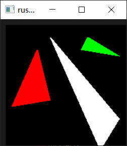

# Rust tinyrenderer

跟着 [ssloy/tinyrenderer](https://github.com/ssloy/tinyrenderer/wiki) 写软渲染。

使用 TGA、读取模型之类的代码可以参考 [tests](./tests) 文件夹下对应的测试代码。

每个课程对应的代码通过 [branch](https://github.com/Latias94/rust-tiny-renderer/branches) 来划分。

## 部分截图

